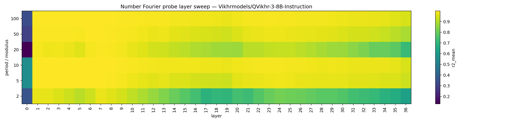
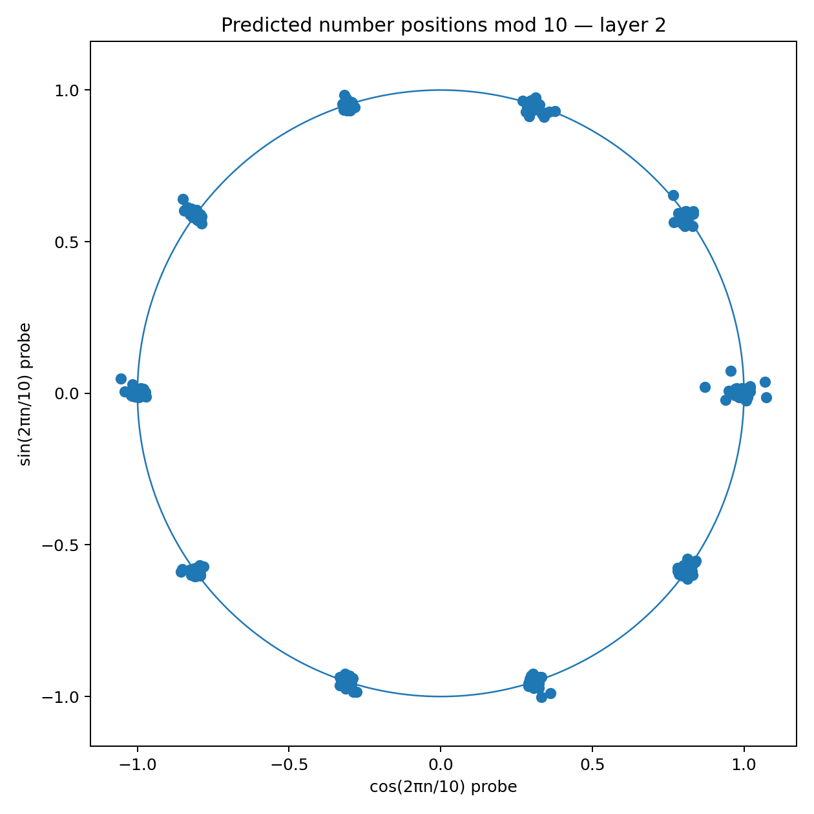
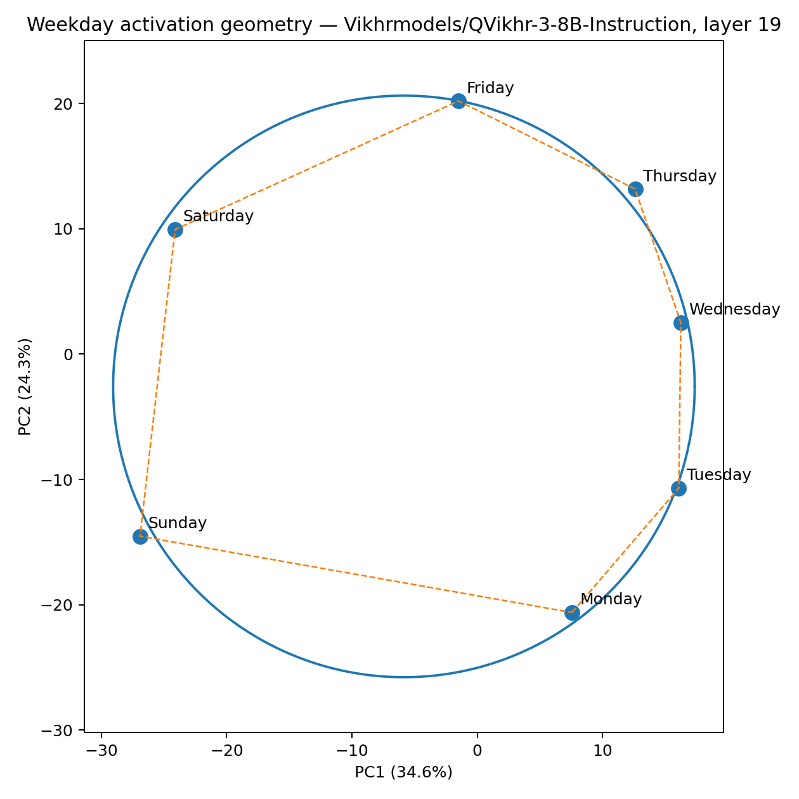

# Neural Geometry Lab

> A small, hackable **exploratory** toolkit inspired by Goodfire-style neural-geometry experiments — find **circular representations**, **Fourier features**, and **modular-arithmetic geometry** inside LLM hidden activations.
>
> 🟡 **Honest scope (v0.1):** this is a *starter kit*, not a causal-abstraction framework. It surfaces *suggestive* geometric structure in activations. For full causal-mechanism studies (activation patching, path steering, output manifolds) see [**Goodfire Causalab**](https://github.com/goodfire-ai/causalab). **Not affiliated with, endorsed by, or a reimplementation of Goodfire.**

[](https://www.python.org/downloads/)
[](LICENSE)
[](#contributing)

<p align="center">
  
</p>

<p align="center"><em>Per-layer linear decodability of <code>(cos 2πn/p, sin 2πn/p)</code> from prompt activations. Yellow ≈ near-perfect <code>R²</code> — the model literally stores numbers as phases on multiple circles.</em></p>

---

## What this is

`nglab` is a research-grade, lightweight Python toolkit for studying **the geometry of LLM hidden states**:

- Are days of the week arranged in a **circle** inside the model?
- Are integers stored on **multiple modular wheels** (mod 5, 10, 100) simultaneously?
- Does the model compute `a + b` by **rotating** representations on those circles?
- At which **layer** does each phenomenon emerge?

The toolkit is inspired by recent neural-geometry research (e.g. **Goodfire**'s work on circular representations in language models, and **Nanda et al.** on modular arithmetic in grokked transformers) and gives you a clean, reproducible starting point to run those experiments on **any Hugging Face causal LM** — from GPT-2 to Llama-3 to Qwen.

### When to use this vs. Goodfire Causalab

| Need | Use |
|---|---|
| Quickly see whether a model has circular/Fourier structure in activations | **this toolkit** |
| Single-GPU exploratory probing, layer sweeps, pretty plots | **this toolkit** |
| Hypothesis-generation before a serious interpretability study | **this toolkit** |
| Causal abstraction: define a high-level algorithm, check that internal components implement it | [**Goodfire Causalab**](https://github.com/goodfire-ai/causalab) |
| Activation patching, path steering, output manifolds, pullback analyses | [**Goodfire Causalab**](https://github.com/goodfire-ai/causalab) |
| Reproducing the official `weekdays_8b_pipeline` / `weekdays_geometry.ipynb` workflows | [**Goodfire Causalab**](https://github.com/goodfire-ai/causalab) |

**Rule of thumb.** Use this toolkit to *find* a candidate structure in 10 minutes; use Causalab to *prove* it implements an algorithm.

### Features

- **CLI + Streamlit UI** — `nglab weekdays`, `nglab numbers`, `nglab addition`, or a browser-based explorer.
- **Layer sweeps** with one flag (`--layers all`) — generate heatmaps showing where each representation lives.
- **Fourier probes** — linear `R²` of `cos/sin(2πn/p)` decoded from hidden states, per layer and period.
- **PCA circle metrics** — quantify how close a class of activations is to a true ring (`angle_mae_deg`, `adjacent_similarity_gap`).
- **Lightweight activation steering** hooks for follow-up causal experiments.
- **No fancy deps** — `torch`, `transformers`, `numpy`, `pandas`, `sklearn`, `matplotlib`. Runs on a single GPU; small models run on CPU.

---

## Showcase — what the output looks like

Curated demo on an 8B instruction-tuned LLM lives in [`showcase/`](showcase/):

| | |
|:---:|:---:|
|  |  |
| **Numbers `0..99` on the mod-10 wheel** — 10 tight clusters of 10 points each. | **Days of the week as a heptagon** in the correct cyclic order. |

See [`showcase/README.md`](showcase/README.md) for the full walkthrough and interpretation of every plot — including a **negative** result (modular addition is *not* cleanly geometric in an 8B model).

---

## Install

```bash
git clone https://github.com/BorisLoveDev/neural-geometry-toolkit.git
cd neural-geometry-toolkit
python -m venv .venv && source .venv/bin/activate
pip install -e .
```

For the Streamlit UI: `pip install -e ".[app]"`.

GPU is optional but recommended for any model above ~1B parameters. CPU / Apple-MPS works for `gpt2` and similar.

---

## Quickstart

### Days of the week as a circle

```bash
nglab weekdays --model gpt2 --layers all --outdir runs/gpt2_weekdays
```

Generates per-layer PCA plots (`weekday_circle_layer_*.png`), an arc-vs-chord plot, and a CSV of metrics. Look at `angle_mae_deg` — random ordering scores around 50°; a clean cyclic embedding scores under 25°.

### Numbers on modular wheels

```bash
nglab numbers --model gpt2 --layers all \
  --start 0 --end 99 \
  --periods 2,5,10,20,50,100 \
  --outdir runs/gpt2_numbers
```

Generates a `fourier_scores_numbers_heatmap.png` (R² over layer × period) and one mod-10 circle plot per layer. The heatmap is usually the most informative single artifact.

### Addition as a geometric calculator

```bash
nglab addition --model gpt2 --layers all \
  --max-a 20 --max-b 20 \
  --periods 2,5,10,20,50 \
  --outdir runs/gpt2_addition
```

Tests whether `(a + b) mod p` can be linearly decoded from the activation right before the answer token.

### Larger model (any HF id, no special config)

```bash
nglab weekdays --model Qwen/Qwen2.5-0.5B --layers all --batch-size 8 \
  --outdir runs/qwen05_weekdays

nglab numbers --model meta-llama/Llama-3.2-3B --layers all \
  --device-map auto --dtype bf16 --outdir runs/llama32_3b_numbers
```

### Streamlit UI

```bash
streamlit run streamlit_app.py
```

Pick a model, task, and layer in the sidebar; preview plots in the browser.

---

## How it works (one-paragraph version)

For each task we build a small prompt dataset where a target token (`Monday`, `17`, …) appears in multiple natural contexts. We forward each prompt through the model with `output_hidden_states=True`, average the hidden state over the target token's positions, and obtain one activation per (target value, prompt). Then:

- **Circle metrics** — fit PCA to per-class centroids; measure radius dispersion, angular order error, and adjacency cosine gap.
- **Fourier probes** — ridge-regress hidden states onto `cos(2πn/p), sin(2πn/p)` for each period `p`; report cross-validated `R²`.
- **Layer sweep** — repeat for every layer; plot a `period × layer` heatmap.

That's it. The full extraction pipeline lives in [`nglab/core.py`](nglab/core.py); probing logic in [`nglab/geometry.py`](nglab/geometry.py).

---

## Project layout

```
neural-geometry-toolkit/
├── nglab/
│   ├── core.py        # model loading + activation extraction
│   ├── datasets.py    # prompt datasets for each task
│   ├── geometry.py    # circle metrics + Fourier probes
│   ├── plotting.py    # plots
│   ├── steering.py    # lightweight activation steering hooks
│   └── cli.py         # argparse CLI
├── examples/
│   └── neural_geometry_quickstart.ipynb
├── showcase/          # demo results on an 8B model
├── ng_lab.py          # CLI entrypoint
└── streamlit_app.py   # browser UI
```

---

## Honest limitations (read before drawing conclusions)

This is an early exploratory toolkit. The following are real gaps, not nitpicks:

1. **PCA pictures are suggestive, not causal.** A clean circle in activation space does not prove the model uses it for computation. For causal claims, run activation patching / steering / ablation — most cleanly via [Goodfire Causalab](https://github.com/goodfire-ai/causalab).
2. **Linear decodability ≠ used downstream.** A high-`R²` Fourier probe means the information is *there*; it might be a passenger feature. Always confirm with interventions before any mechanistic claim.
3. **No baselines / controls shipped yet (v0.1).** This toolkit does not currently run: random-label baselines, random-model baselines, train/test splits by *value* (not just by prompt), or unseen-number / unseen-template held-out evaluations. **Without these you cannot rule out probe-side fitting.** See the roadmap below.
4. **Small models often show weaker signal.** If you see noise on `gpt2`, that may be the model rather than a bug — try a 1B–8B instruct model.
5. **Tokenization matters.** The extractor tries to use the exact target span; with unusual tokenizers, sanity-check via the saved `prompts_*.csv`.
6. **Negative results are normal — and underdetermined here.** In the 8B `showcase/` demo, modular *addition* did not yield a clean geometric calculator. Without the controls in point 3, treat that as a *prompt* for further investigation, not a conclusion about the model.

---

## Roadmap

**Near-term (closing the v0.1 gaps):**

- **Tests** — token-span extraction, layer indexing, Fourier probe shape, shuffled-label baseline equivalence, train/test split correctness.
- **Controls and baselines** — random-label probe (must collapse to chance), random-model probe (sanity floor), split-by-value (not just by prompt), held-out unseen numbers, held-out unseen prompt templates.
- **Reproducibility** — pinned seeds, deterministic data ordering, small reference CSVs to diff against.

**Mid-term (causal mode):**

- **Phase-rotation steering** along learned circle directions (move θ, not a linear delta).
- **Centroid patching** between class centroids at a chosen layer.
- **Subspace ablation** to test whether the geometric subspace is *load-bearing*.
- **Counterfactual activation patching** between cyclic and arithmetic prompts.

If you want the production-grade version of the causal mode today, use [**Goodfire Causalab**](https://github.com/goodfire-ai/causalab) — it ships `activation_manifold`, `output_manifold`, `path_steering`, and `pullback` analyses out of the box. This toolkit will integrate with `transformer-lens` and stay deliberately lightweight.

Activation bundles are saved to `activations_*.npz` so any of the above can be built on top of existing runs without re-extracting.

---

## Related work and inspiration

- [**Goodfire Causalab**](https://github.com/goodfire-ai/causalab) — official open-source framework for causal-abstraction interpretability; ships `weekdays_8b_pipeline`, `weekdays_geometry.ipynb`, and analyses like `activation_manifold`, `output_manifold`, `path_steering`, `pullback`. **The serious version of what this toolkit is gesturing at.**
- **Goodfire** — engineering-focused interpretability lab; foundational write-ups on circular and modular representations in LLMs.
- Nanda et al., *Progress measures for grokking via mechanistic interpretability* — discrete Fourier features in transformers trained on modular addition.
- Engels et al., on circles for *days of the week / months / hours* in language models.
- Anthropic's interpretability work on feature geometry and circuits.

**Not affiliated with Goodfire.** This is an independent, MIT-licensed exploratory toolkit. If you use it in research, please cite it via [`CITATION.cff`](CITATION.cff).

---

## Contributing

Issues and PRs welcome. Particularly useful contributions:

- New task datasets (months, hours, compass directions, base-conversion).
- Integration with `transformer-lens` for richer hook-based interventions.
- Causal steering wrappers and patching utilities.
- Reproductions on additional model families — please share PNGs and metrics in a PR.

---

## License

MIT — see [LICENSE](LICENSE).

---

## Other languages

- 🇷🇺 [README на русском](README_RU.md)
