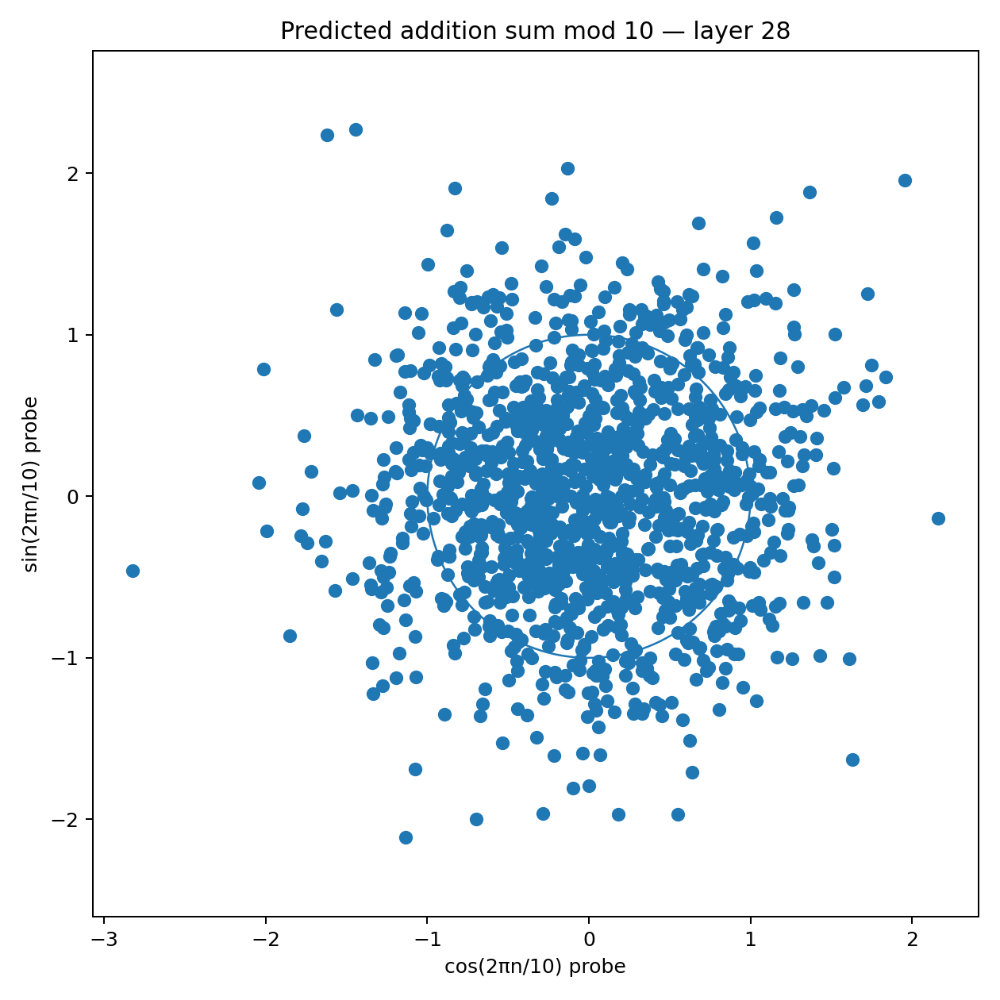

# Showcase — example outputs of Neural Geometry Lab

> ⚠️ **What this is.** A visual tour of the kinds of plots and metrics `nglab` produces, generated end-to-end on a public **8B instruction-tuned causal LM** (`Vikhrmodels/QVikhr-3-8B-Instruction`).
>
> ⚠️ **What this is *not*.** A scientific result. **No baselines or controls were run** (random-label probe, random-model probe, split-by-value, unseen prompts). High `R²` numbers below can be partly probe-fitting; we have not ruled that out. Treat everything here as *suggestive of structure worth investigating*, not as evidence the model uses these representations causally. For rigorous causal claims see [Goodfire Causalab](https://github.com/goodfire-ai/causalab).

If you're new here, read the [main README](../README.md) first.

## What the plots look like (no causal claims)

| Experiment | What we see | Caveat |
|---|---|---|
| **Numbers 0–99 on modular wheels** | Probe `R²` ≈ 0.95–1.0 from layer 1 onward for periods 5, 10, 50, 100 | No random-label baseline run — some `R²` may be probe-fitting |
| **Days of the week as a circle** | At layer 19, PCA gives a near-perfect heptagon in correct cyclic order | Suggestive, not causal |
| **Addition `a+b mod p`** | One period decodes well (`R²` ≈ 0.96), other periods don't — picture is a blob | Without controls we can't distinguish "model doesn't use this" from "probe didn't fit" |

Russian-language version of this walkthrough: [`README_RU.md`](README_RU.md).

---

## 1. Numbers — `01_numbers_heatmap_KEY.png`

Per-layer (x) × per-period (y) heatmap of cross-validated `R²` for the linear
probe `hidden_state → (cos 2πn/p, sin 2πn/p)`. Yellow ≈ near-perfect linear
decodability — the activation literally stores number `n` as a phase on a
circle of period `p`.

**Reading it.**

- Left edge (layer 0, embeddings) is darker — number representations are still
  "raw".
- From layer 1 onward almost the entire grid is yellow. The model carries the
  number as a phase on **several circles simultaneously** (mod 5, 10, 50, 100).
- Periods 2 and 20 dip in the middle layers — the model temporarily reshapes
  those representations.

**Takeaway.** Strong positive evidence for the "numbers as points on multiple
modular circles" hypothesis inside this model.

## 2. Numbers — modular-10 circle

`02b_numbers_mod10_layer02_BEST.png` shows the **best layer**:

Each point is a number `0..99` projected through the learned probe into
`(cos, sin)` space. Numbers sharing the same residue mod 10 (e.g. `7, 17, …, 97`)
collapse into a single tight cluster, and the 10 clusters sit at evenly spaced
angles on the unit circle. **This is the "mod-10 wheel" inside the model.**

Compare:

- `02a_numbers_mod10_layer00_baseline.png` — embeddings only. Some structure,
  but blurry clusters.
- `02c_numbers_mod10_layer18_middle.png` — middle layer, slightly noisier than
  layer 2.
- `02d_numbers_mod10_layer36_final.png` — final layer, structure degrades as
  the model commits to a specific output token.

## 3. Days of the week — heptagon at layer 19

`03b_weekdays_layer19_BEST.png`:

PCA projection of activations for the tokens `Monday … Sunday`, averaged over
multiple natural prompts. Seven points lie on a near-perfect ring, and going
clockwise from Friday the order is `Friday → Thursday → Wednesday → Tuesday →
Monday → Sunday → Saturday → Friday` — i.e. correct cyclic order (direction
doesn't matter geometrically).

Metrics on this layer:

| Metric | Value | Interpretation |
|---|---|---|
| `angle_mae_deg` | 20.1° | Random ordering would score ≈ 50° |
| `adjacent_similarity_gap` | 0.44 | Adjacent days are much closer than non-adjacent ones |

Compare with `03a_weekdays_layer00_baseline.png` — embeddings already form an
approximate ring, but order is messier (`angle_mae=29°`, `gap=0.07`). The model
"tightens" the circle by layer 19.

`03c_weekdays_layer19_arc_vs_chord.png` shows that the manifold path between
Monday and Friday goes through intermediate weekdays, rather than slicing
through the centre — evidence the ring is a real low-dimensional structure,
not a PCA artefact.

## 4. Addition — a negative result

`04a_addition_layer28_BEST.png`:

For prompts `a + b =`, we attempt to linearly decode `(a + b) mod 10` from the
activation just before the answer token. If the model implemented arithmetic
as **phase addition on modular wheels**, we'd see 10 tight clusters as in
experiment 2. Instead we get a broad cloud loosely concentrated around the
unit circle.

Looking at the per-period summary at this layer:

| Period | R² |
|---|---|
| 2 | 0.27 |
| 5 | −0.04 |
| 10 | 0.49 |
| 20 | 0.75 |
| 50 | **0.96** |
| Mean | 0.49 |

So one period decodes very well, but the others don't — the model **does not**
implement addition as a clean parallel-circles computation in this 8B
configuration. Possible explanations:

- The "geometric calculator" mechanism may need a larger model.
- The mechanism may exist but on different periods than the ones we tested.
- The model may use a different algorithm entirely (e.g. memorisation +
  lookup for small sums).

Next experiments to disambiguate:

- Repeat on a 30–70B model.
- Widen the addition range beyond 20 + 20.
- Add causal **activation steering** along the strong direction (period 50)
  and measure logit shifts on numeric answer tokens.

---

## Files

| File | What it is |
|---|---|
| `01_numbers_heatmap_KEY.png` | Layer × period Fourier-probe R² heatmap |
| `02a..02d_numbers_mod10_layer*.png` | mod-10 circle from selected layers |
| `03a..03c_weekdays_layer*.png` | Weekday PCA circles |
| `04a..04b_addition_layer*.png` | Modular-addition decoding plots |
| `metrics_summary.csv` | Key numeric metrics behind the four conclusions above |

## Bottom line (honest version)

The plots above are **what you'd expect to see if** Vikhr-3-8B encoded numbers and weekdays on circles, and **what you'd expect to see if** modular addition is not implemented purely geometrically at this scale. That is consistent with the geometric hypothesis — but this toolkit at v0.1 does not yet run the controls needed to make that a conclusion (no shuffled-label probe, no random-model floor, no split-by-value, no unseen-prompt held-out). Until those are run, read everything here as *hypothesis-generation*. The right follow-up is `Goodfire Causalab` or your own causal-mode extension of this toolkit.
